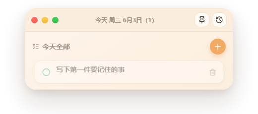

# RemarkBook

RemarkBook 是一个用 Tauri + React 构建的桌面备忘录/待办小窗。它平时保持轻量悬浮，展开后可以管理今日任务、历史记录、主题和窗口置顶状态。数据保存在本机 WebView 存储里，不需要账号，也不会上传到云端。



## 功能

- 今日任务视图：默认聚焦今天需要处理的事项。
- 已完成自动下沉：今日列表中，已完成任务会自动排到最下面。
- 过期未完成自动顺延：过去日期还没完成的任务会继续出现在今天任务里。
- 历史记录：按周和日期折叠展示，支持搜索和状态筛选。
- 历史全屏查看：点击黄色按钮，或双击窗口顶部，可以全屏展示历史；再次点击/双击恢复。
- 小窗模式：红色按钮可收起为迷你悬浮条。
- 置顶和透明度：支持窗口置顶，置顶时自动降低透明度，减少遮挡。
- 主题设置：支持亮/暗模式、预设主题、强调色、字体大小和透明度。
- 中英文界面：可在设置里切换语言。

## 下载

从 [GitHub Releases](https://github.com/f12336414-ship-it/remarkbook/releases) 下载对应系统安装包。

| 平台 | 推荐文件 | 说明 |
| --- | --- | --- |
| Windows | `.msi` 或 `.exe` | 双击安装。也可以使用项目里的 Windows portable zip。 |
| macOS | `.dmg` | 打开后拖入 Applications。未签名版本首次打开可能需要右键选择“打开”。 |
| Linux | `.AppImage` 或 `.deb` | AppImage 可直接运行，deb 可用系统包管理器安装。 |

## 本地开发

需要 Node.js 20+ 和 Rust 工具链。

```bash
npm install
npm run tauri:dev
```

常用命令：

```bash
npm run lint
npm run build
npm run tauri:build
```

## 发布和打包

Windows 本机可以生成便携包：

```powershell
npm run package:windows
```

产物路径：

```text
release/windows/RemarkBook-Windows-Portable.zip
```

三平台安装包通过 GitHub Actions 构建。推送 `v*` 标签会自动创建 GitHub Release，并分别在 Windows、macOS、Linux runner 上生成安装包：

```bash
git tag v0.1.3
git push origin v0.1.3
```

也可以在 Actions 页面手动运行 `Release` workflow。手动运行时会把各平台构建产物上传为 workflow artifacts，方便下载测试。

## 技术栈

- Tauri 2
- React 19
- TypeScript
- Vite
- lucide-react

## License

MIT
